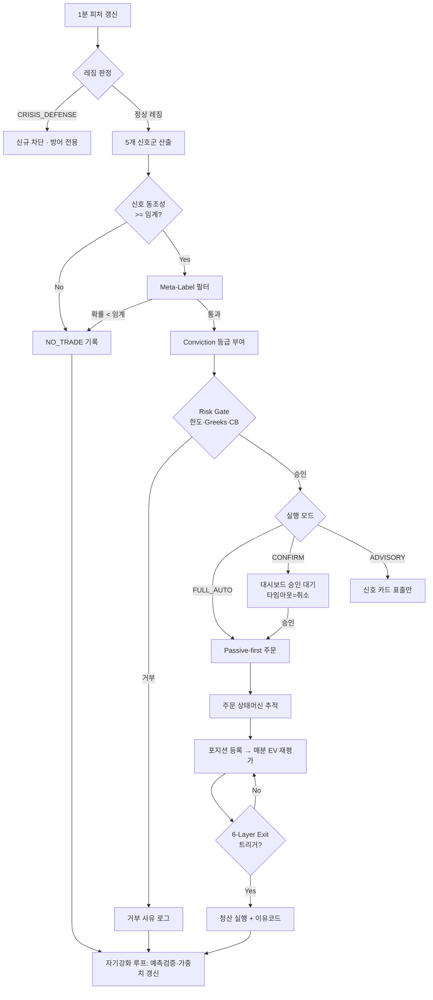

# 🧭 MAHDI ULTIMATE SYSTEM v6 — MASTER BLUEPRINT
## KOSPI200 옵션 자동/수동 하이브리드 진입·청산 시스템 종합 설계도

> **"시장을 맞히려는 시스템이 아니라, 구조적으로 유리할 때만 위험을 꺼내 쓰는 시스템."**
>
> 프로젝트 경로: `C:\Users\82108\PycharmProjects\options`
> 기반 기술: Python 3.1x (64-bit) + 한국투자증권(KIS) OpenAPI (REST + WebSocket)
> 통합 원본: v2 (Core Engines) · v3 (Hedge Fund Intelligence) · v4 (Operating Doctrine) · v5 (요구사항 정의)
> 상태: **Master Blueprint — 구현 착수 기준 문서**

---

# PART 0. Executive Summary

MAHDI v6는 KOSPI200 옵션의 실시간 데이터를 수집·분석하여, **방향성 예측이 아니라 구조적 우위**가 확인된 순간에만 진입하고, 기대값이 소멸하는 순간 지체 없이 청산하는 **자동/수동 하이브리드 트레이딩 운영체계**다.

이 시스템이 수익화하는 것은 가격의 상승/하락이 아니라 다음 **4대 알파 원천(Alpha Ledger)** 이다:

| # | 알파 원천 | 핵심 메커니즘 | 담당 엔진 |
|---|-----------|---------------|-----------|
| A1 | **변동성의 비대칭성** | IV-RV 스프레드(VRP), Skew 왜곡, 감마 비선형성 | Options Intelligence |
| A2 | **시장 미시구조 불균형** | OFI, VPIN, Queue Imbalance, Absorption | Order Flow Engine |
| A3 | **딜러 헤지 플로우** | GEX/Gamma Flip, Vanna·Charm 드리프트, 만기 Pinning | Gamma Map Engine |
| A4 | **수급 주체 왜곡** | 외국인/기관/개인 포지션 비대칭, Trap 구조 | Position Intelligence |

4대 운영 원칙:

1. **당일 청산 절대 원칙** — 15:10 이전 강제 평탄화. 야간 갭 리스크 원천 차단.
2. **하이브리드 실행** — 자동(Full-Auto) / 반자동(Confirm) / 수동(Advisory) 3모드 + 원클릭 비상정지.
3. **자기 강화 학습** — 매 1분, 예측 오차와 실행 결과를 다음 분의 가중치에 즉시 반영.
4. **챔피언-도전자 진화** — 실거래 모델(챔피언)과 섀도우 모델(도전자)이 매일 경쟁, 규칙 기반 승격/강등.

---

# PART 1. System Philosophy

## 1.1 핵심 공리 (Axioms)

```text
Axiom 1. Price is the shadow. Order flow is the cause.
         가격은 그림자다. 주문흐름이 원인이다.
Axiom 2. 옵션 시장은 파생상품 시장이 아니라, 스마트머니의 리스크 대차대조표다.
Axiom 3. 강한 신호보다 중요한 것은 그 신호가 어떤 레짐에서 발생했는가이다.
Axiom 4. 높은 기대수익보다 먼저 확보해야 할 것은 낮은 파산확률이다.
Axiom 5. 모든 진입은 가설이고, 청산은 검증이다.
Axiom 6. 좋은 전략은 예측률이 아니라 손익비, 손실 비대칭, 반복 가능성에서 드러난다.
Axiom 7. 당일 청산 원칙은 성과 제약이 아니라 생존 프리미엄이다.
Axiom 8. 자동화는 감정을 제거하기 위한 것이고, 수동 개입은 자동화의 사각지대를 메우기 위한 것이다.
```

## 1.2 시스템 비유 — 다섯 개의 기관(器官)

| 기관 | 역할 | 주기 | 담당 파트 |
|------|------|------|-----------|
| 🧭 **나침반** | 장 시작 전 오늘의 시장 레짐(방향·변동성 체제) 결정 | 장전 1회 + 15분 갱신 | Regime Engine |
| 📡 **레이더** | 매 1분 수급·옵션구조·미시체결 신호 탐지 | 1분 (틱 보조) | Flow·Options·Volume Engine |
| 🧑‍✈️ **항해사** | 신호를 그대로 믿지 않고 레짐·리스크 예산 안에서 행동으로 변환 | 신호 발생 시 | Signal Fusion + Meta-Label |
| 🖥️ **관제센터** | 포지션, Greeks, 손익, 강제청산 거리, 시스템 건강도를 한 화면 통제 | 실시간 | Dashboard + Risk Engine |
| 🔬 **연구소** | 틀린 예보와 실행 결과를 다음 분/다음 날 규칙으로 환류 | 1분 + 일배치 | Self-Learning + C/C Framework |

## 1.3 성공 기준

- 높은 승률보다 **손실 분포 통제** (왼쪽 꼬리 절단)
- 단일 대박보다 **누적 기대값 우위**
- 과최적화보다 **견고한 일반화** (Deflated Sharpe 기준)
- 직관보다 **규칙 우선**, 규칙보다 **생존 우선**
- 시그널 개수보다 **실행 품질(슬리피지·체결률)** 우선

---

# PART 2. Alpha Ledger — 무엇을 수익화하는가

> 이 파트가 v6의 심장이다. "왜 돈이 벌리는가"를 정의하지 못한 지표는 채택하지 않는다.

## 2.1 A1: 변동성의 비대칭성 (Volatility Asymmetry)

| 하위 알파 | 메커니즘 | 진입 방식 | 학술 근거 |
|-----------|----------|-----------|-----------|
| VRP 수확 | 평균적으로 IV > 실현변동성 (보험료 프리미엄) | 안정 레짐 + positive GEX에서 제한적 프리미엄 매도 | Carr & Wu (2009) |
| VRP 역전 포착 | 이벤트 전 IV가 오히려 저평가되는 순간 | Long Straddle/Strangle | Bollerslev-Todorov (2011) 꼬리 프리미엄 |
| Skew 왜곡 | 공포 과잉 시 풋 IV 과열 → 정상화 회귀 | 동일 델타 스큐 스프레드 | Bakshi-Kapadia-Madan (2003) |
| 일중 세타 비대칭 | 옵션 프리미엄 감소는 야간에 집중, 일중 세타 수확은 제한적 | **일중 프리미엄 매도 전략의 기대값을 보수적으로 설정** | Muravyev & Ni (2020) |
| 위클리 0DTE 감마 | 만기 당일 감마 폭발 + 딜러 헤지 증폭 | §11.4 0DTE 플레이북 | Brogaard et al. (2023) 0DTE 문헌 |

## 2.2 A2: 시장 미시구조 불균형 (Microstructure Imbalance)

| 하위 알파 | 지표 | 해석 | 학술 근거 |
|-----------|------|------|-----------|
| 주문흐름 충격 | **OFI (Order Flow Imbalance)** | 가격 변화는 OFI에 선형 비례 → 단기 방향 선행 | Cont-Kukanov-Stoikov (2014) |
| 독성 주문 탐지 | **VPIN** | 정보거래자 활성화 → 추세추종 가중 or 회피 | Easley-López de Prado-O'Hara (2012) |
| 호가 선행가격 | Microprice, Queue Imbalance | 다음 틱 방향의 최우수 단기 예측치 | Stoikov (2018) |
| 흡수(Absorption) | 대량 체결에도 가격 불변 | 기관의 조용한 축적/분산 → 반전·지속의 핵심 단서 | Kyle (1985) 프레임 |
| 일중 모멘텀 | 첫 30분 수익률 → 마지막 30분 예측력 | 장 후반 방향 베팅 overlay | Gao-Han-Li-Zhou (2018) |

## 2.3 A3: 딜러 헤지 플로우 (Dealer Flow)

| 하위 알파 | 지표 | 해석 |
|-----------|------|------|
| 감마 지형 | GEX, Gamma Flip Level | +GEX: 딜러가 변동성 억제(회귀장) / −GEX: 증폭(추세·급변장) |
| 감마 벽 | Strike별 감마 집중 | 가격 자석(Pinning) — 만기 근접 시 극대화 (Ni-Pearson-Poteshman 2005) |
| **Vanna 플로우** | IV 변화 → 딜러 델타 재조정 | IV 하락일에 딜러 매수 헤지 유입 → 상방 드리프트 |
| **Charm 플로우** | 시간 경과 → 델타 감쇠 | 장 마감 1~2시간 전 Charm 방향 드리프트 (Barbon-Buraschi 2020) |
| OI 이동 | 행사가별 미결제 이동 | 스마트머니의 전장(戰場) 이동 추적 |

## 2.4 A4: 수급 주체 왜곡 (K-Market Specific)

| 하위 알파 | 로직 | 비고 |
|-----------|------|------|
| 외국인 우위 추세 | 외국인 순매수 + 개인 손실 구간 → 추세 지속 | 주체별 추정 VWAP 대비 손익 상태 추적 |
| Trap 구조 | 개인 롱 쏠림 + 외국인 역행 → Bull Trap 경보 | 역발상 신호 |
| USDKRW 선행 | 환율 급변 → 외국인 플로우 30분~수시간 선행 | 보조 확인 신호 |
| 만기·리밸런싱 왜곡 | 위클리/먼슬리 만기, MSCI 리밸런싱 | 장전 캘린더 경보 |

---

# PART 3. Academic & Institutional Foundations

## 3.1 이론 지도

| 분야 | 프레임워크 | 시스템 내 역할 |
|------|-----------|----------------|
| 시장 미시구조 | Kyle (1985), Glosten-Milgrom (1985) | 정보 비대칭·주문 독성 해석 |
| 주문흐름 | Easley et al. (2012) VPIN, Cont et al. (2014) OFI | 독성·불균형 실시간 측정 |
| 변동성 모델 | Heston (1993), Dupire Local Vol | IV Surface 캘리브레이션 |
| 변동성 프리미엄 | Carr & Wu (2009), Bollerslev-Todorov (2011) | VRP 수확/역전 판단 |
| 딜러 플로우 | Barbon & Buraschi (2020), Ni et al. (2005) | GEX·Vanna·Charm·Pinning |
| 레짐 전환 | Hamilton (1989) HMM | 시장 상태 분류 |
| 실행 알고리즘 | Almgren-Chriss (2001), Avellaneda-Stoikov (2008) | 슬리피지 최소화·호가 동학 |
| 금융 ML | López de Prado (2018) | Meta-Labeling, Triple Barrier, Purged CV, DSR |
| 베팅 크기 | Kelly (1956), Thorp | Fractional Kelly 사이징 |
| 딥헤징 | Buehler et al. (2019) Deep Hedging | (Phase 3+) 신경망 기반 헤지 정책 연구 트랙 |
| 꼬리 위험 | Taleb Convexity | Tail Hedge·손실 비대칭 통제 |
| 일중 계절성 | Gao et al. (2018), Muravyev & Ni (2020) | 시간대별 전략 가중치 |

## 3.2 적용 원칙

- 논문 이름을 장식으로 넣지 않는다. **채택 지표는 [입력 → 계산 → 해석 → 실패 조건] 4요소를 반드시 함께 정의한다.**
- 한국 옵션시장 현실(유동성 편중, 만기 왜곡, 수급 집중, 호가단위)에 맞지 않으면 원형 유지보다 로컬 적합화가 우선.
- 백테스트에서 강해 보여도 실거래 마찰비용을 이기지 못하면 폐기한다.

---

# PART 4. Market Scope & Operating Constraints

## 4.1 대상 시장

- **주시장**: KOSPI200 옵션 (먼슬리 + 위클리 월/목 만기)
- **보조 시장**: KOSPI200 선물(방향·속도 판단의 기준), KOSPI 현물, USDKRW
- **글로벌 확인 신호**: VIX(및 기간구조), S&P500 선물, USDCNH, US 10Y, MOVE

## 4.2 운영 제약

| 항목 | 규칙 |
|------|------|
| 기본 시간축 | 1분봉 중심, 틱은 미시구조 지표 계산용 |
| 보조 시간축 | 3분, 5분, 15분, 일중 누적 |
| 거래 시간 | 09:00 ~ 15:45 (파생) |
| 장전 워밍업 | 08:45~09:00 본장 전 완료 — 스케일러 동결, 갭 z-score, 레짐 prior 조정 (§16.1) |
| 진입 게이트 | 고정 시각이 아닌 **지표별 준비도(readiness) 기반 개방** — 갭/레짐/감마 신호는 09:00 즉시, 플로우 신호(OFI·VPIN)는 볼륨 버킷 충전·스프레드 정상화 확인 후(통상 09:03~05) |
| 신규 진입 컷오프 | 14:50 이후 신규 진입 금지 |
| **강제 평탄화** | **15:10 이전 완료 (운영 헌법)** |
| 야간 노출 | 원칙적 금지 |
| 브로커 | 한국투자증권 KIS OpenAPI (실전/모의 겸용) |

## 4.3 KIS OpenAPI 연동 설계 원칙

```text
[REST]      토큰 발급/갱신 · 주문(신규/정정/취소) · 잔고/체결 조회 · 옵션 체인 스냅샷
[WebSocket] 실시간 체결가 · 실시간 호가 · 실시간 체결통보(주문 상태)
```

- **토큰 수명 관리**: 접근토큰 만료 전 자동 갱신 데몬. 갱신 실패 = Data Quality Alert + 자동매매 일시정지.
- **레이트리밋 방어**: REST 호출은 우선순위 큐로 직렬화(주문 > 체결조회 > 시세보조). 시세는 WebSocket 우선.
- **실시간 구독 슬롯 관리**: 세션당 등록 가능 건수 제한 존재 → ATM ± N행사가 동적 구독(가격 이동 시 구독 롤링), 선물·환율은 상시 고정 슬롯. **08:30~09:00에는 예상체결가/예상체결수량을 한시 구독**하고 09:00 개장과 동시에 해제하여 본장 옵션 체인 슬롯으로 환원한다.
- **주문 상태머신**: 체결통보 유실 대비, REST 폴링 보조 확인(reconciliation) 루프 상시 가동.
- **모의투자 우선**: 모든 신규 로직은 모의계좌 → 소액 실계좌 → 정상 사이즈 순서로만 승격.

## 4.4 전략 철학의 현실화

미국 대형 옵션시장과 달리 한국 옵션시장은 특정 시간대 유동성 편중, 만기일 왜곡, 수급 주체 집중, 단기 감마 쏠림의 영향이 크다. 따라서 MAHDI v6는 **장기 옵션 포지셔닝보다 intraday 구조 우위와 당일 리스크 회수**를 중시하며, 상대가치 전략은 완전자동보다 **경보형/반자동형**으로 운영한다.

---

# PART 5. Data Architecture

## 5.1 데이터 카탈로그

| 구분 | 데이터 | 용도 | 주기 |
|------|--------|------|------|
| 핵심 | K200 선물 가격/거래량/호가 | 기초자산 방향·속도·미시구조 | 틱, 1분 |
| 핵심 | 옵션 체인 (가격, IV, OI, 거래량, 호가) | 옵션 구조 해석 | 틱(ATM 근처), 1분 |
| 핵심 | 호가잔량, 체결강도, OI 변화 | 주문흐름 독성 | 틱 |
| 핵심 | 외국인/기관/개인 수급 | 주체 우위 판단 | 1분, 누적 |
| 핵심 | Greeks, GEX, Gamma Flip, Vanna/Charm 맵 | 딜러 플로우 | 1분 |
| 핵심 | RV(1/5/15분), Range Expansion | 변동성 상태 | 1분 |
| 핵심 | VPIN, OFI, Microprice, Queue Imbalance | 미시 불균형 | 틱→1분 집계 |
| 핵심 | VWAP, Anchored VWAP, Volume Profile | 공정가치·체결 밀집 | 1분 |
| 보조 | USDKRW | 외국인 플로우 선행 | 1분, 5분 |
| 보조 | VIX, VIX 기간구조, S&P 선물, USDCNH, US10Y, MOVE | 글로벌 리스크 필터 | 장전, 5분 |
| 보조 | 이벤트 캘린더 (경제지표, 만기, 리밸런싱) | 이벤트 리스크 | 장전 |

## 5.2 데이터 품질 원칙

- 틱 누락·체결 지연·비정상 스파이크는 **별도 품질 플래그**로 관리 (품질 악화 = 자동매매 정지 트리거).
- **실시간 신호와 백테스트 신호는 동일한 feature definition을 사용한다** (단일 피처 사전 = Single Source of Truth).
- 옵션 체인은 행사가별 결측·스프레드 확대 구간을 명시적으로 처리한다.
- 누적 수급은 세션 중 재집계 가능해야 한다.

## 5.3 파이프라인 계층

```text
Raw Feed Layer (KIS WebSocket/REST, 글로벌 보조피드)
  → Cleaned Market Feed Layer (품질 플래그, 시계 동기화)
  → Feature Layer (피처 사전 기반 — 실시간/백테스트 공용)
  → Signal Layer (엔진별 1차 시그널)
  → Decision Layer (Fusion + Meta-Label + Risk Gate)
  → Execution Log Layer (주문·체결·슬리피지·이유코드)
  → Research Archive Layer (자가학습·C/C 평가·연구 큐)
```

---

# PART 6. Architecture Overview

## 6.1 전체 구조도

```text
┌─────────────────────────────────────────────────────────────────────────┐
│                       MAHDI v6 COMMAND CENTER                           │
├─────────────────────────────────────────────────────────────────────────┤
│                                                                         │
│  🧭 나침반          📡 레이더 (매 1분)                                   │
│ ┌──────────┐   ┌──────────┬──────────┬──────────┬──────────┐           │
│ │ E1 REGIME │   │ E2 FLOW  │ E3 OPTIONS│ E4 VOLUME│ E5 POSITION│         │
│ │ ENGINE    │   │ MICRO-   │ INTEL +  │ STRUCTURE│ INTEL     │          │
│ │ (HMM +    │   │ STRUCTURE│ GAMMA MAP│ (VAP/POC)│ (수급주체) │          │
│ │  Macro)   │   │ (OFI/VPIN)│(GEX/Vanna)│         │           │          │
│ └────┬─────┘   └────┬─────┴────┬─────┴────┬─────┴────┬─────┘           │
│      │ 가중치 스위치  │          │          │          │                  │
│ ┌────▼──────────────▼──────────▼──────────▼──────────▼────┐            │
│ │       🧑‍✈️ E6 SIGNAL FUSION + META-LABELING               │            │
│ │  [Regime Weighting → Conflict Resolution → Meta Filter]  │            │
│ │  [Conviction: NO_TRADE / TEST / STANDARD / HIGH]          │            │
│ └───────────────────────────┬───────────────────────────────┘            │
│ ┌───────────────────────────▼───────────────────────────────┐            │
│ │  🛡️ E7 RISK & CAPITAL ENGINE  (독립 거부권 보유)            │            │
│ │  [Fractional Kelly × Regime × Vol-Target × DD-Adjust]     │            │
│ │  [Portfolio Greeks 한도 · Circuit Breaker · Kill Switch]   │            │
│ └───────────────────────────┬───────────────────────────────┘            │
│ ┌───────────────────────────▼───────────────────────────────┐            │
│ │  ⚡ E8 EXECUTION & HYBRID EXIT ORCHESTRATOR                │            │
│ │  [Auto / Confirm / Advisory 3모드] [6-Layer Exit]          │            │
│ │  [Passive-first 진입, 주문 상태머신, 15:10 Forced Flat]    │            │
│ └───────────────────────────┬───────────────────────────────┘            │
│ ┌───────────────────────────▼───────────────────────────────┐            │
│ │  🔬 E9 SELF-REINFORCEMENT + CHAMPION/CHALLENGER            │            │
│ │  [매분 예측검증 → 가중치 갱신] [Drift Detection]            │            │
│ │  [Champion 실거래 / Challenger 섀도우 / 규칙 기반 승격]     │            │
│ └────────────────────────────────────────────────────────────┘            │
└─────────────────────────────────────────────────────────────────────────┘
```

## 6.2 판단 4계층

1. **관측**: 시장에서 무엇이 일어나고 있는가 (E1~E5)
2. **해석**: 그 변화는 어떤 구조를 의미하는가 (E6)
3. **결정**: 어떤 거래를, 얼마나, 어떤 한도 안에서 (E7)
4. **실행**: 어떻게 진입·축소·철수할 것인가 (E8)

그리고 E9가 1~4 전체를 매분/매일 다시 학습시킨다.

---

# PART 7. Core Engine 1: Regime Intelligence (🧭 나침반)

## 7.1 목적

개별 지표의 좋고 나쁨보다 **지금 시장이 어떤 상태인지** 먼저 판단한다. 레짐은 모든 하위 엔진의 **가중치 스위치**다.

## 7.2 상태 공간 (8-State)

| Regime | 의미 | 우선 전략군 |
|--------|------|-------------|
| TREND_UP_STRONG | 강한 상승 추세 | 콜 매수, 콜 데빗 스프레드, pullback 매수 |
| TREND_DOWN_STRONG | 강한 하락 추세 | 풋 매수, 풋 데빗 스프레드 |
| RANGE_BALANCED | 평균회귀 우세 | 짧은 mean reversion, 제한적 프리미엄 수확 |
| RANGE_BREAK_PREP | 압축 후 확장 대기 | 브레이크아웃 대기, 비대칭 진입 준비 |
| VOL_EXPANSION | 변동성 팽창 | Directional Long Gamma 우세 |
| VOL_COMPRESSION | 변동성 압축 | 돌파 대기, 스트래들 저가 매집 검토 |
| LIQUIDITY_THIN | 유동성 빈약 | 규모 축소, 선택적 거래 |
| CRISIS_DEFENSE | 위기/이벤트 | 신규 진입 차단, Tail Hedge 우선 |

## 7.3 입력 변수와 계산

- **Hurst Exponent** (R/S): H>0.6 추세 / H<0.4 회귀
- **ADX**, RV Ratio (RV5d/RV20d > 1.3 → 팽창)
- ATM IV 변화율, VIX 기간구조 (Contango/Backwardation)
- Cross-asset stress: USDKRW·USDCNH·US10Y 급변
- Order book thinning (호가 잔량 급감)
- Intraday breadth

```python
def detect_regime(features_1m, features_15m) -> RegimeState:
    """
    - HMM(GaussianHMM, 8 states) 기반 베이지안 확률 산출
    - 1분 단기 레짐 vs 15분 상위 레짐 충돌 시 → 상위 레짐 우선
    - CRISIS_DEFENSE 진입 시 → 신규 방향 베팅 차단
    - 레짐 확률 벡터(8차원)를 Feature Store에 매분 기록
    """
```

## 7.4 실패 조건 (명시)

- 이벤트 직후 분산 급등으로 레짐 확률 불안정 → `REGIME_UNSTABLE` 플래그, 사이즈 자동 축소
- 장 초반 데이터 부족 구간 → 전일 마감 레짐 + 장전 매크로 스코어 + 갭 z-score 조정 prior(§16.1 WARMUP ④)로 대체, 연속 세션 데이터 축적 후 HMM으로 전환
- 만기일 특정 구간 왜곡 → 만기일 전용 파라미터 세트로 스위칭

---

# PART 8. Core Engine 2: Order Flow & Microstructure (📡 레이더 1)

## 8.1 목적

캔들보다 먼저 **체결과 호가의 비대칭**을 읽는다. 가격 움직임의 '원인'을 해석하는 엔진.

## 8.2 핵심 지표

| 지표 | 의미 | 해석 |
|------|------|------|
| **OFI** | 최우선 호가 잔량 변화 기반 주문흐름 불균형 | 단기 가격변화와 선형 관계 — 방향 선행 신호 |
| **VPIN** | 정보거래 확률 | >0.7 정보거래자 활성 → 회귀 전략 금지, 추세/회피 |
| Microprice | 잔량 가중 중심가격 | 다음 틱 방향의 단기 선행가격 |
| Queue Imbalance | 최우선 호가잔량 비대칭 | 체결 압력 방향 |
| Absorption | 대량 체결에도 가격 불변 | 반전 or 지속의 핵심 단서 |
| Aggressive Sweeps | 여러 호가 훑는 공격 체결 | 스마트머니 흔적 |

```python
def calculate_ofi(bid_px, bid_qty, ask_px, ask_qty) -> float:
    """
    Cont-Kukanov-Stoikov (2014) Order Flow Imbalance
    e_n = ΔBidQty·1{bid유지/상승} - ΔAskQty·1{ask유지/하락}  (경계조건 처리)
    OFI = Σ e_n  (1분 윈도우)
    해석: OFI 급증 + 가격 미반영 = 압력 축적 → 방향 진입 후보
    실패 조건: 호가 스프레드 급확대 구간에서는 신뢰도 하락 → 가중치 자동 축소
    """
```

## 8.3 해석 로직

- 가격 상승 + OFI·Microprice·Aggressive Buy 동조 → **진성 추세 가중**
- 가격 상승 + 흡수 매도 누적 → **False Breakout 경보**
- VPIN 급등 구간 → mean reversion 금지, 추세추종 또는 거래 회피

## 8.4 헤지펀드식 확장

- **LOB Event Tagging**: 잔량 취소/신규 적층/스윕을 이벤트 레벨로 태깅
- **Toxicity Zones**: 시간대×가격대별 독성 지대 학습 (히트맵으로 대시보드 표출)
- **Maker/Taker Stress Meter**: 유동성 공급자 vs 공격 체결자 우위 게이지

---

# PART 9. Core Engine 3: Options Intelligence & Gamma Map (📡 레이더 2)

## 9.1 목적

옵션 시장에서 **변동성 기대, 꼬리위험 가격, 딜러 감마 포지션, 수급 비대칭**을 동시에 읽는다.

## 9.2 핵심 구성

| 항목 | 기능 | 핵심 질문 |
|------|------|-----------|
| IV Surface | 행사가·만기별 변동성 지도 | 시장은 미래 변동성을 과대/과소평가 중인가 |
| Skew / Smile | 하방 공포·상방 스퀴즈 해석 | 꼬리위험 수요는 방어인가 베팅인가 |
| **GEX** | 딜러 헤지 물량 지형 | 딜러는 시장을 안정시키는가, 증폭시키는가 |
| **Gamma Flip** | 딜러 헤지 방향 전환 레벨 | 이 레벨 이탈 시 변동성 폭발 준비 |
| **Gamma Wall** | 감마 집중 행사가 (자석) | 가격이 어디에 붙들리는가 (만기 근접 시 극대화) |
| **Vanna Map** | IV 변화에 따른 딜러 델타 재조정 | IV 하락 시 딜러 매수 유입 방향은 |
| **Charm Map** | 시간 경과에 따른 델타 감쇠 | 마감 1~2시간 전 드리프트 방향은 |
| OI Migration | 행사가별 미결제 이동 | 스마트머니 전장 이동 |
| IV-RV Spread (VRP) | 변동성 프리미엄 | 지금 옵션은 비싼가 싼가 |

```python
class GammaMapEngine:
    def calculate_gex(self, chain) -> float:
        """GEX = Σ(Gamma × OI × multiplier × S²/100), call(+) put(-) 관례"""
    def find_gamma_flip(self) -> float:
        """GEX 부호가 바뀌는 기초자산 레벨 — 이탈 시 urgency 모드"""
    def gamma_walls(self, top_n=3) -> list:
        """감마 집중 상위 행사가 — Pinning 후보, 부분청산 기준선"""
    def vanna_charm_drift(self, now) -> dict:
        """
        Vanna: dDelta/dVol → IV 변화 방향과 결합해 딜러 재헤지 방향 추정
        Charm: dDelta/dTime → 14:00 이후 Charm 방향 드리프트 가중치 활성화
        실패 조건: OI 데이터 지연·이벤트 당일에는 신뢰도 하향
        """
```

## 9.3 전략 연결

- **+GEX 환경** → mean reversion·짧은 익절 전략 가중, 감마 벽 부근 부분청산
- **−GEX + Gamma Flip 하방 이탈** → Directional Long Gamma 가중, 실행 urgency 상향
- **IV≫RV + 안정 레짐** → 제한적 프리미엄 매도 (시스템 최고 신뢰 레벨에서만, Muravyev-Ni 일중 세타 보수화 반영)
- **이벤트 직전 IV 급등 + Skew 왜곡** → 비선형 리스크 신호로 취급, 신규 방향 베팅 축소

---

# PART 10. Core Engine 4 & 5: Volume Structure + Position Intelligence (📡 레이더 3·4)

## 10.1 Volume Structure & Fair Value

- **Session VWAP** + **Anchored VWAP** (시가/고거래 이벤트/돌파점 기준)
- **Volume Profile**: POC(공정가치), VAH/VAL(가치영역 70%), HVN(지지·저항)/LVN(가속 구간)
- **Volume Spike / Exhaustion**: `spike = current_vol / avg_vol`, 3배 이상 + 가격 정체 = Absorption 의심

해석 원칙:
- 가격이 VWAP 위 + 외국인 우위 + 감마 우호 + 미시체결 강세 **동시 충족** → 추세 확률 상향
- LVN 돌파 = 속도 구간 / HVN 복귀 = 회귀 가능성 / **POC 붕괴 = 균형점 상실** (단순 이탈이 아님)

## 10.2 Position Intelligence (주체 분석 — 한국 시장 특화)

```python
class InstitutionalTracker:
    def entity_vwap(self, entity, lookback):  # 외국인/기관/개인 추정 평균단가
    def profit_state(self):                    # 주체별 미실현 손익 상태
    def trap_detection(self):
        """
        if retail_long_ratio > 0.7 and foreign_net < -threshold:
            return BULL_TRAP  (개인 쏠림 + 외국인 역행)
        if foreign_profit and retail_loss:
            return TREND_CONTINUATION  (추세 지속 구조)
        """
    def smart_money_flow(self):                # 기관+외국인 자금흐름 분리 CMF
```

---

# PART 11. Core Engine 6: Signal Fusion, Meta-Labeling & Strategy Palette (🧑‍✈️ 항해사)

## 11.1 융합 구조

```text
Primary Signal Layer   (방향 · 변동성 · 미시구조 · 수급 · 감마 5개 신호군)
  → Regime Weighting Layer      (레짐별 신호 가중치 스위치)
  → Conflict Resolution Layer   (신호 충돌 시 상위 우선순위 규칙)
  → Meta-Label Classifier       (이 진입을 실제로 실행할 가치가 있는가)
  → Conviction Score
  → Trade Permission: NO_TRADE / SMALL_TEST / STANDARD / HIGH_CONVICTION
```

## 11.2 Meta-Labeling (López de Prado 2단계)

- **1차 모델**: 진입 후보 생성 (방향/변동성 가설)
- **2차 모델**: 그 후보의 실행 가치 필터링 (RandomForest/XGBoost)
- 메타 모델 입력: regime confidence, 신호 동조 개수, 최근 슬리피지 상태, 감마 레짐, 외국인 플로우 정합성, 이벤트 근접도, **최근 N회 동일 셋업 성과(자기강화 피드백)**
- 학습 레이블: **Triple Barrier** (익절/손절/시간 배리어 중 최초 도달)
- 검증: **Purged K-Fold + Embargo** (누수 차단)

## 11.3 앙상블 구성 (동적 가중)

```python
ENSEMBLE = {
    "regime_hmm":            {"base_w": 0.20},
    "xgboost_tabular":       {"base_w": 0.20},
    "lstm_temporal":         {"base_w": 0.15},
    "options_flow":          {"base_w": 0.20},   # GEX/Vanna/Charm/VRP
    "orderflow_ofi_vpin":    {"base_w": 0.15},
    "flow_position":         {"base_w": 0.10},   # 수급 주체
}
# 고정 가중치 금지 — E9가 최근 성과 기반으로 매일 재배분 (Thompson Sampling, §14.3)
```

## 11.4 Strategy Palette (레짐 × IV 매트릭스)

```text
┌────────────────────────────────────────────────────────────────────┐
│            OPTIONS STRATEGY SELECTION MATRIX                       │
│  레짐 \ IV 상태  │ IV 저평가(VRP<0) │ IV 적정      │ IV 고평가(VRP>0) │
│ ────────────────┼────────────────┼─────────────┼──────────────── │
│  TREND_STRONG   │ ATM Long       │ ITM/Debit    │ Debit Spread    │
│  RANGE_TIGHT    │ 소형 Strangle   │ 관망 우선     │ (최고신뢰시)     │
│                 │ Buy            │              │ 제한적 프리미엄매도│
│  VOL_EXPANSION  │ ATM Straddle   │ Long Gamma   │ Short Gamma 금지 │
│  VOL_COMPRESSION│ Straddle 매집   │ 돌파 대기     │ 극히 제한적 매도  │
└────────────────────────────────────────────────────────────────────┘
```

**구조적 선택 규칙**
- 하루 레짐당 우선 전략군 **2개 이하**로 제한 (다각화는 전략 수가 아니라 알파 원천의 다각화).
- 변동성 매도 계열은 시스템 **최고 신뢰 레벨 + positive GEX + 안정 레짐**에서만 허용.
- 상대가치(패리티 이탈, 합성선물 괴리, 만기간 IV 왜곡)는 **경보형/반자동** 운영.

**위클리 0DTE 플레이북 (만기 당일 전용)**
- 감마 폭발·Pinning 극대화 구간 — 별도 파라미터 세트 적용
- 진입: Gamma Wall 이탈 직후 Long Gamma 속도전 / Wall 수렴 시 Pinning 회귀 스캘프
- 사이즈 상한: 평시의 50%, 시간손절: 평시의 절반
- 14:00 이후 Charm 드리프트 방향 우선

---

# PART 12. Core Engine 7: Risk & Capital Allocation (🛡️ 독립 거부권)

> 리스크 엔진은 신호 엔진의 하위 모듈이 아니다. **항공기의 실속 경보처럼 독립 회로**로 작동하며, 어떤 신호도 거부할 수 있다.

## 12.1 사이징 프레임워크

```text
Final Size = Base Size
           × Fractional Kelly (Quarter Kelly 기본, Full Kelly 절대 금지)
           × Regime Confidence
           × Signal Quality (Meta 확률)
           × Volatility Targeting (target_vol / realized_vol)
           × Liquidity Score (호가 두께·스프레드)
           × Drawdown Adjustment (DD 구간 자동 축소)
           × Portfolio Capacity Constraint (Greeks 한도 잔여분)
```

## 12.2 한도 체계

| 한도 | 기본값 | 위반 시 |
|------|--------|---------|
| 단일 트레이드 손실 | 계좌의 −0.5% | 진입 거부 |
| 일일 손실 한도 | 계좌의 −2% | 신규 거래 중단 |
| 주간 손실 한도 | −5% | 시스템 Review 모드 |
| 최대 드로우다운 | −10% | 자동 거래 정지 + 수동 재가동만 허용 |
| 동일 방향 동시 포지션 | 3개 | 초과 진입 거부 |
| 포트폴리오 Greeks | Delta/Gamma/Vega 상한 | 신규 진입 거부 or 부분 축소 |
| 하루 최대 거래 횟수 | 전략별 상한 | 초과 시 차단 (과잉거래 방지) |

## 12.3 Circuit Breaker & Kill Switch

```python
HALT_CONDITIONS = {
    "daily_loss_pct":      -0.02,
    "drawdown_pct":        -0.10,
    "vpin_crisis":          0.90,   # 유동성 위기
    "vix_spike":            40,
    "usdkrw_daily_change":  0.02,
    "data_quality_fail":    True,   # 피드 끊김/지연
    "model_drift":          True,   # ADWIN 드리프트 감지
}
# 발동 시: 신규 차단 → gradual_delever() → 필요 시 emergency_flatten()
# 물리적 Kill Switch: 대시보드 상단 상시 노출 + 키보드 단축키
```

## 12.4 방어 시나리오 (Tail Risk Engine)

| 상황 | 조치 |
|------|------|
| 2σ 역행 | 신규 중단, 포지션 절반 축소 검토 |
| 3σ 역행 | 강제 리스크 회수, 손실확대 전략 금지 |
| Gamma Wall 붕괴 + 외국인 역행 | 전량 축소 또는 완전 철수 |
| 유동성 공백 + 스프레드 급확대 | 시장가 추격 금지, 지정가 사다리 청산으로 전환 |

**핵심 철학: 수익은 공격에서 나오지만, 계좌는 방어에서 살아남는다.**

---

# PART 13. Core Engine 8: Execution & Hybrid Exit Orchestrator (⚡)

## 13.1 하이브리드 실행 3모드

| 모드 | 진입 | 청산 | 용도 |
|------|------|------|------|
| **FULL_AUTO** | 자동 | 자동 | 검증 완료 챔피언 전략, 정상 레짐 |
| **CONFIRM** | 대시보드 원클릭 승인 후 실행 (타임아웃 시 자동 취소) | 손절·강제평탄화는 무조건 자동 | 신규 승격 전략, 고변동 레짐 |
| **ADVISORY** | 신호만 표시, 주문은 수동 | 청산 제안 + 수동 | 도전자 전략 관찰, 상대가치 경보 |

**불변 규칙**: 모드와 무관하게 **Hard Stop, Circuit Breaker, 15:10 Forced Flat은 항상 자동**이다. 수동 모드는 공격의 자유이지 방어의 자유가 아니다.

## 13.2 진입 규율

- 신호 발생 즉시 시장가 추격을 기본값으로 두지 않는다 — **Passive-first Limit Entry** (안정 레짐).
- −GEX 팽창 국면에서만 **Urgency Mode** (공격적 체결 허용).
- 호가 간격·체결 빈도·잔량 두께 기반으로 공격성 자동 조절 (Almgren-Chriss 프레임).
- 시초 5분·이벤트 직후에는 공격성 자동 하향.
- **물타기(averaging down) 기본 금지.**
- 부분 체결 인지 주문 상태머신: `PENDING → PARTIAL → FILLED / CANCELLED / REJECTED` + 체결통보-REST 이중 확인.

## 13.3 6-Layer Exit Stack (하이브리드 청산 시스템의 심장)

| 레이어 | 트리거 | 자동/수동 |
|--------|--------|-----------|
| 1. **Hard Stop** | 절대 허용 손실 한도 (진입가 기준 −1~2%) | 항상 자동 |
| 2. **Structure Stop** | VWAP 이탈, POC 붕괴, Gamma Wall 돌파 | 자동 (CONFIRM 모드에선 3초 경고 후 자동) |
| 3. **Flow Stop** | 외국인 수급 반전, OFI/Microprice 역행 | 자동/제안 |
| 4. **Belief Decay Stop** | 메타 확률·EV 하락 (아래 13.4) | 자동/제안 |
| 5. **Time Stop** | 기대 속도 미달 (레짐별 최대 보유시간) | 자동 |
| 6. **Forced Flat** | 15:10 이전 무조건 청산 | **항상 자동, 해제 불가** |

## 13.4 확률 기반 청산 (매 1분 재평가)

```python
def reevaluate_position(pos, market) -> ExitDecision:
    """
    진입 후에도 매 1분마다 기대값을 다시 계산한다.
    EV = P(win|현재상태) × AvgWin − P(loss) × AvgLoss − Theta_decay − 예상슬리피지

    4대 악화 항목 동시 체크:
      ① EV 감소   ② 레짐 악화   ③ 변동성 상태 불일치   ④ 슬리피지 악화
    → 2개 악화: 부분 축소(50%) 제안
    → 3개 이상: 손익 무관 전량 철수
    """
```

## 13.5 레짐 적응형 청산 파라미터

```python
EXIT_RULES = {
    "TREND_STRONG":    {"trailing": 0.015, "profit_target": None, "time_stop": 120},
    "RANGE_TIGHT":     {"profit_target": 0.015, "stop": -0.008, "time_stop": 30,
                        "theta_exit": True},   # 레인지에서 시간은 독이다
    "VOL_EXPANSION":   {"stop": -0.010, "gamma_scalping": True, "time_stop": 45},
    "EXPIRY_DAY_0DTE": {"stop": -0.008, "time_stop": 15, "size_cap": 0.5},
}
# 감마 벽 접근 시 부분 익절(스케일아웃) 기본 활성화
```

---

# PART 14. Core Engine 9: Self-Reinforcement Learning & Champion-Challenger (🔬)

## 14.1 자기 강화 학습 — 매 1분 피드백 루프 (바둑 AI 원리)

```text
[t분]   예측 발행: 방향·확률·근거 피처 → prediction_logs 기록
[t+1분] 검증: 실제 수익률과 대조 → was_correct, error 기록
        ├─ 신호원별 최근 적중률 갱신 (지수가중 이동평균)
        ├─ 앙상블 가중치 미세 조정 (online learning, River)
        ├─ 진행 중 포지션의 belief score 갱신 → Exit Layer 4에 즉시 반영
        └─ ADWIN 드리프트 감지 → 감지 시 해당 모델 가중치 강등 + 재학습 큐 등록
[일마감] 일 단위 재학습: 메타 모델 증분 학습, toxicity zone 갱신,
         시간대별 edge decay 측정, 전략별 성과 귀속(attribution)
```

**원칙**: 실시간 루프는 **가중치 조정까지만** 허용한다. 모델 구조 변경·신규 피처 투입은 반드시 연구 생명주기(§14.4)를 거친다. 매분 학습이 매분 과최적화가 되어서는 안 된다.

## 14.2 학습 항목

- Feature importance drift / 레짐별 hit ratio / 슬리피지 추세
- 시간대별 edge decay / 만기주 이상현상 지속성
- 동일 셋업 반복 성과 (셋업 지문(fingerprint) 단위 추적)

## 14.3 전략 자본 배분 — Thompson Sampling

```python
class StrategyAllocator:
    """
    전략별 성과를 Beta 분포로 유지: Beta(wins+1, losses+1)
    매일 아침 샘플링 → 리스크 예산 배분 비율 결정
    - 최근 성과 우수 전략: 자연스럽게 배분 확대 (exploitation)
    - 부진 전략: 축소되되 완전 소멸은 방지 (exploration 보존)
    - 반감기 적용: 오래된 성과는 지수 감쇠 (시장은 변한다)
    """
```

## 14.4 Champion-Challenger 프레임워크

```text
                    ┌─────────────────────────────┐
   실거래 자본  ───▶│  CHAMPION (현역 모델/전략)    │──▶ 실제 주문
                    └─────────────────────────────┘
                    ┌─────────────────────────────┐
   동일 데이터  ───▶│  CHALLENGER 1..N (도전자)     │──▶ 섀도우 신호만 기록
                    └─────────────────────────────┘   (가상 체결가 = 보수적 슬리피지 가정)
                              │
                              ▼  매일 스코어카드 갱신, 매주 판정
```

**승격 규칙 (모두 충족 시에만)**

| 기준 | 조건 |
|------|------|
| 관찰 기간 | 섀도우 ≥ 30거래일 **그리고** ≥ 100 신호 |
| 성과 우위 | 비용 반영 후 기대값이 챔피언 대비 통계적 우위 (부트스트랩 p<0.05) |
| 강건성 | 최소 2개 이상 레짐에서 우위 유지 (단일 레짐 몰빵 금지) |
| 꼬리 안전 | 최대 낙폭·CVaR가 챔피언보다 나쁘지 않을 것 |
| 해석 가능성 | 우위의 원인을 Alpha Ledger(A1~A4)로 설명 가능할 것 |

**승격 절차**: 섀도우 → **소액 실거래(MICRO_LIVE, 30일)** → 정상 사이즈. 단계 건너뛰기 금지.

**강등 규칙**: 챔피언이 연속 20거래일 기대값 음(−) + 도전자 우위 지속 → 챔피언을 CONFIRM 모드로 강등, 도전자 MICRO_LIVE 개시. **동시 전면 교체 금지** (점진 전환).

## 14.5 연구 생명주기 (Research Intake)

```text
Idea Intake (논문/시장관찰/일마감 이상현상 태그)
  → Data Specification (피처 사전 등록: 입력·계산·해석·실패조건)
  → Offline Test (이벤트 기반 백테스트, 비용 2배 가정 생존 확인)
  → Robustness Test (Walk-forward + Purged CV + Monte Carlo + DSR)
  → Shadow Deployment (Challenger 등록, 30일+)
  → Micro Live (최소 사이즈 30일)
  → Promotion / Rejection (승격 or 폐기 — 폐기 사유도 아카이브)
```

---

# PART 15. Validation & Backtest Standards

## 15.1 검증 철학

강한 백테스트는 출발점일 뿐이다. 실전 배치 기준은 **마찰비용과 드리프트를 이겨낸 뒤에도 남는 기대값**이다.

## 15.2 필수 검증 스택

- Walk-Forward Optimization (훈련 252일 / 검증 63일 / 21일마다 재훈련)
- Purged K-Fold CV + Embargo (누수 차단)
- Monte Carlo 경로 재배열 (10,000회)
- 스프레드 확대 스트레스 테스트 / 슬리피지 2배 가정 생존 테스트
- 레짐 분할 테스트 (수익이 한 레짐에만 몰리는가)
- 비용 사후 귀속 (post-cost attribution)
- **Deflated Sharpe Ratio > 1.0** (Bailey & López de Prado — 파라미터 탐색 횟수 보정)

## 15.3 현실적 백테스트 가정

```python
REALISTIC_ASSUMPTIONS = {
    "fill":          "next_bar",        # 신호 다음 봉 체결
    "slippage":      "market_impact",   # √volume 비례 충격 모델
    "commission":    "실제 수수료율",
    "partial_fill":  True,
    "spread_model":  "옵션 호가단위·유동성 반영",
}
```

## 15.4 폐기 기준 / 필수 질문

- 수익이 특정 며칠에만 집중되는가 / 만기일 효과를 빼면 알파가 남는가
- 슬리피지 2배에서도 생존하는가 / 특정 시간대에만 편향되는가
- Out-of-sample 약화가 과도한가 / 해석 가능한 원인이 없는가 → **폐기**

---

# PART 16. 전체 실행 흐름 (End-to-End Execution Flow)

## 16.1 하루의 타임라인

```text
┌──────────┬────────────────────────────────────────────────────────────────┐
│ 07:30    │ [시스템 기동] 토큰 발급, 피드 헬스체크, DB 무결성, 전일 로그 검증    │
│ 08:00    │ [🧭 나침반] 글로벌 매크로 스코어: VIX 기간구조, S&P선물, USDKRW,   │
│          │  USDCNH, US10Y · 이벤트/만기/리밸런싱 캘린더 → 오늘의 위험 예산 결정 │
│ 08:20    │ [감마 지형 사전 계산] 전일 OI 기반 GEX, Gamma Flip, Wall, 주요     │
│          │  행사가 · 전일 POC/VAH/VAL → 시나리오 카드 3장 (Base/Stress/Crisis)│
│ 08:30    │ [프리마켓 수집] 예상체결가/예상체결수량 한시 구독 개시                 │
│          │  · 초반 값은 취소 가능 주문 기반이라 왜곡 가능 → 마지막 3~5분 시간 가중│
│          │  · 예상체결가 변동폭 축소(수렴) 여부를 품질 플래그로 기록              │
│ 08:45    │ [🔥 WARMUP 페이즈 — 본장 전 완료]                                  │
│          │  ① 피처 스케일러 동결: z-scale 파라미터를 직전 20일 분포로 계산 후    │
│          │     세션 단위 freeze (장중 재계산 금지 — 백테스트와 정의 일치)        │
│          │  ② 갭 z-score = (예상체결가 − 전일종가) ÷ 전일 ATM 스트래들 내재     │
│          │     오버나이트 기대변동폭 → "옵션시장이 예상 못 한 갭"만 측정          │
│          │  ③ Eurex 야간 세션·S&P 선물·USDKRW 통합 → Opening Context 확정     │
│          │  ④ 갭 z 크기에 따라 레짐 사전확률(prior) 조정 (大갭 → VOL_EXPANSION)│
│          │  ⑤ 리스크 예산·전략 팔레트 사전 무장(pre-arm)                       │
│ 09:00    │ [엔진 ON — readiness 기반 계층 가동] 1분 루프 즉시 개시              │
│          │  · 갭/레짐/감마맵 신호: 즉시 유효 (갭 전용 플레이북만 축소 사이즈 허용)│
│          │  · OFI/VPIN/Absorption: burn-in — 계산은 하되 진입 게이트 차단      │
│          │  · 예상체결가 구독 해제 → 본장 옵션 체인 슬롯 환원                    │
│ 09:03~05 │ [플로우 게이트 개방] VPIN 볼륨 버킷 충전 + 옵션 스프레드 정상화        │
│          │  확인 시점에 지표별 개방 (고정 09:10 규칙 폐지 — 조건 충족 기반)       │
│ 09:00~   │ ┌── 매 1분 루프 ──────────────────────────────────────────┐      │
│ 15:45    │ │ ① Ingest: 틱→1분 집계, 품질 플래그                      │      │
│          │ │ ② Feature: 피처 사전 일괄 계산 (OFI·VPIN·GEX·VAP·수급)  │      │
│          │ │ ③ Regime: HMM 확률 갱신 (15분 상위 레짐과 정합성 체크)   │      │
│          │ │ ④ Signal: 5개 신호군 1차 시그널                         │      │
│          │ │ ⑤ Fusion: 레짐 가중 → 충돌 해소 → Meta 필터 → Conviction│      │
│          │ │ ⑥ Risk Gate: 한도·Greeks·서킷브레이커 심사 (거부권)      │      │
│          │ │ ⑦ Execute: 모드별 실행 (Auto/Confirm/Advisory)          │      │
│          │ │ ⑧ Position Loop: 보유 포지션 EV 재평가 → 6-Layer Exit   │      │
│          │ │ ⑨ Log & Learn: 예측 검증, 가중치 갱신, 드리프트 감시      │      │
│          │ └─────────────────────────────────────────────────────────┘      │
│ 11:30~   │ [점심 유동성 진공] 자동 사이즈 축소, 신규 진입 기준 상향             │
│ 13:00    │                                                                 │
│ 14:00    │ [Charm 드리프트 모드] 마감 헤지 플로우 방향 가중치 활성화            │
│ 14:50    │ [신규 진입 컷오프] 이후 청산 전용                                  │
│ 15:10    │ [⛔ FORCED FLAT] 전 포지션 무조건 평탄화 — 해제 불가                │
│ 15:20    │ [일마감 배치] 체결 품질 분석, 예측-실제 괴리 기록, 이유코드 검증      │
│ 15:40    │ [연구소 가동] C/C 스코어카드 갱신, Thompson 배분 재계산,            │
│          │  메타모델 증분학습, 이상현상 연구 큐 태깅, 내일 관찰 포인트 생성      │
│ 16:00    │ [리포트] 일일 대시보드 리포트 자동 생성 → 아카이브                   │
└──────────┴────────────────────────────────────────────────────────────────┘
```

## 16.2 신호 → 주문 의사결정 흐름 (Mermaid)



## 16.3 진입 허용 체크리스트 (모든 항목 통과 시에만)

```text
[ ] 상위 레짐과 하위 레짐이 충돌하지 않는가
[ ] 주문흐름(OFI·Microprice·Absorption)이 가격을 지지하는가
[ ] 옵션 구조(GEX·IV·Skew)가 가설을 지지하는가
[ ] 주요 감마 레벨이 포지션에 치명적으로 불리하지 않은가
[ ] 일중 손실 버퍼가 충분한가
[ ] 장마감까지 남은 시간이 전략에 충분한가 (Time-to-Flat 체크)
[ ] 이벤트 리스크가 통제 가능한가
```

---

# PART 17. 🖥️ MAHDI COCKPIT — 대시보드 설계

## 17.1 설계 철학: "3초 룰"

> 화면을 본 지 3초 안에 **① 지금 시장이 어떤 상태인지 ② 내가 무엇을 해야 하는지 ③ 무엇을 하면 안 되는지**가 보여야 한다. 예쁜 그래프보다 **행동 유도형 레이아웃**.

- **색 문법 (고정)**: 🟢 실행 허용 · 🔵 관찰 · 🟡 경고 · 🔴 위험/차단 — 색약 대응을 위해 색+아이콘+텍스트 삼중 표기
- **정보 밀도 계층**: 상단(즉시 행동) → 중단(구조 판단) → 하단(맥락·연구)
- **소리 규율**: 경보음은 Circuit Breaker·강제청산·CONFIRM 요청 3종만. 알림 피로 금지.
- **다크 테마 기본** (장시간 관제 피로 최소화), 손익 숫자는 대형 타이포

## 17.2 메인 화면 — COCKPIT 레이아웃

```text
┌──────────────────────────────────────────────────────────────────────────────┐
│ MAHDI COCKPIT   2026-07-04 13:42:07   ⛔KILL   모드:FULL_AUTO ▾   ⏱️Flat까지 88분│
├──────────────┬──────────────┬──────────────┬──────────────┬─────────────────┤
│ 🧭 REGIME     │ 📡 CONVICTION │ 🛡️ RISK BUDGET│ 💰 P&L TODAY  │ ⚡ GEX REGIME    │
│ TREND_UP     │ ████████ 78% │ ████░░ 62%   │ +₩1,240,000  │ −1.2B ⚠️        │
│ P=0.82 ▲안정 │ BUY BIAS 🟢  │ 잔여버퍼 -1.2%│ +2.3% 🟢     │ Flip:352.5 근접  │
├──────────────┴──────────────┴──────────────┴──────────────┴─────────────────┤
│ 📊 GAMMA MAP (K200=354.2)          │ 🔥 VOLUME PROFILE                        │
│  357.5 ┤██████ Call Wall 🧲        │  355.0 │███████████ 2.1M                │
│  355.0 ┤███ +GEX                   │  354.0 │████████████████ 3.8M ◀POC      │
│  352.5 ┤━━━━━ GAMMA FLIP ━━━━━     │  353.0 │██████ 1.4M                     │
│  350.0 ┤████████ Put Wall          │  352.0 │██ 0.4M ◀LVN(가속구간)           │
│  Vanna: 상방drift · Charm: 14시↑활성│  VWAP 354.6↑ · AVWAP(시가) 353.9        │
├────────────────────────────────────┼─────────────────────────────────────────┤
│ 🌊 ORDER FLOW RADAR                │ 🏦 수급 INTELLIGENCE                      │
│ OFI(1m):  +842  ▁▂▄▆█ 상승압       │ 외국인:  +₩452B 🟢 (VWAP대비 +0.4% 수익) │
│ VPIN:     0.65  🟡 독성 상승        │ 기관:    −₩120B 🔵                       │
│ Microprice: 354.23 (+0.03 선행)    │ 개인:    −₩310B (추정손실 −0.6%)          │
│ Absorption: 감지됨 @354.0 🔵        │ Trap 스캔: 없음 · USDKRW 1,352 ▼(우호)   │
├────────────────────────────────────┴─────────────────────────────────────────┤
│ 📋 POSITIONS (2)                                                              │
│ ┌───────────────┬───────┬────────┬────────┬──────────┬──────────┬──────────┐ │
│ │ 종목           │ 수량  │ 진입    │ 현재    │ EV(belief)│ 청산거리  │ 상태      │ │
│ │ W2607 355C    │ +10   │ 1.42   │ 1.61   │ ███░ 0.71│ Struct-STOP│ 🟢 HOLD  │ │
│ │               │       │        │ +13.4% │ ▼0.05/1m │ 354.6(VWAP)│ Trail ON │ │
│ │ 2607 350P     │ +5    │ 0.98   │ 0.91   │ ██░░ 0.48│ Hard −8.2% │ 🟡 축소제안│ │
│ │               │       │        │ −7.1%  │ EV감소 2/4│ Time 12분  │ [50%청산]│ │
│ └───────────────┴───────┴────────┴────────┴──────────┴──────────┴──────────┘ │
│ Portfolio Greeks:  Δ+0.42  Γ+0.08  Θ−₩85K/일  V+1.2   (한도 대비 ▓▓▓░░ 58%)  │
├───────────────────────────────────────────────────────────────────────────────┤
│ 🚨 ACTION FEED (행동 필요 항목만)          │ 🏆 CHAMPION vs CHALLENGER          │
│ 13:41 🟡 350P EV악화 2/4 — [50%축소] [무시]│ CH: momentum_v3   +2.3% ██████    │
│ 13:38 🔵 Gamma Flip 1.7pt 접근 — 관찰      │ C1: ofi_fusion_v1 +3.1% ███████🔺 │
│ 13:31 🟢 355C 진입 체결 1.42 (slip 0.7tick)│ C2: vanna_drift   +0.8% ███       │
│                                            │ 승격심사: 12/30일 경과              │
├────────────────────────────────────────────┴──────────────────────────────────┤
│ 시나리오: [BASE 추세지속 60%] [STRESS Flip이탈 30%] [CRISIS 급락 10%]  건강도:🟢 │
└───────────────────────────────────────────────────────────────────────────────┘
```

## 17.3 패널 사양

| 패널 | 내용 | 갱신 | 행동 연결 |
|------|------|------|-----------|
| 상단 스트립 | Kill Switch, 실행 모드 전환, **Forced Flat 카운트다운** | 1초 | 원클릭 비상정지 / 모드 전환 |
| Regime | 현재 레짐 + 확률 + 상위 레짐 정합성 | 1분 | CRISIS 시 전체 테두리 적색 점멸 |
| Conviction | 융합 신호 방향·강도 게이지 | 1분 | HIGH 시에만 녹색 점등 |
| Risk Budget | 잔여 일중 손실 버퍼, Greeks 사용률 | 1분 | 버퍼 30% 미만 시 황색 |
| Gamma Map | GEX 프로파일 + Flip/Wall + Vanna/Charm 상태 | 1분 | Flip 접근 시 경고 |
| Volume Profile | POC/VAH/VAL/LVN + VWAP·AVWAP | 1분 | 구조 붕괴 시 Structure Stop 연동 표시 |
| Flow Radar | OFI 스파크라인, VPIN, Microprice, Absorption | 1분(틱 집계) | 독성 급등 시 진입 게이트 차단 표시 |
| 수급 Intel | 주체별 순매수 + 추정 손익 상태 + Trap 스캔 | 1분 | Trap 감지 시 역발상 카드 |
| Positions | **EV(belief) 바 + 가장 가까운 청산 트리거와의 거리** | 실시간 | 원클릭 [50%축소] [전량청산] |
| Action Feed | 행동이 필요한 항목만 (정보성 로그 분리) | 실시간 | 각 항목에 승인/무시 버튼 |
| C/C 스코어보드 | 챔피언 vs 도전자 누적 성과·승격 심사 진행률 | 일 | 승격 후보 🔺 표시 |
| 시나리오 보드 | 장전 작성 3개 시나리오 + 실시간 확률 | 15분 | 시나리오 전환 시 알림 |

## 17.4 보조 화면

1. **RESEARCH LAB**: 백테스트 결과, DSR, Walk-forward 곡선, 피처 중요도 드리프트, 연구 큐 칸반
2. **EXECUTION QUALITY**: 슬리피지 분포, 체결률, implementation shortfall, 시간대별 체결 품질 히트맵
3. **POST-MARKET REPORT**: 일일 자동 리포트 (예측-실제 괴리, 이유코드별 청산 성과, 내일 관찰 포인트)
4. **TOXICITY HEATMAP**: 시간대×가격대 독성 지대 학습 결과

## 17.5 구현 스택 권고

```yaml
1단계 (신속 구축):  Streamlit + Plotly  — 파이썬 단일 스택, 1분 갱신 충분
2단계 (실시간 강화): FastAPI(WebSocket) + React/Next.js + TradingView Lightweight Charts
공통:              경보 = 브라우저 알림 + 사운드 3종 · 상태 스냅샷은 Redis에서 직독
원칙:              대시보드는 읽기 전용 뷰 + 명령 버튼만. 계산 로직을 UI에 두지 않는다.
```

---

# PART 18. Database & Logging Blueprint

## 18.1 스키마 (TimescaleDB 하이퍼테이블)

```sql
-- 1분봉 시장 원시 데이터
CREATE TABLE market_raw_1m (
    timestamp TIMESTAMPTZ NOT NULL, symbol VARCHAR(20),
    open DECIMAL(18,4), high DECIMAL(18,4), low DECIMAL(18,4), close DECIMAL(18,4),
    volume BIGINT, vwap DECIMAL(18,4),
    vpin DECIMAL(8,6), ofi DECIMAL(12,2), microprice DECIMAL(18,4),
    bid_ask_spread DECIMAL(8,4), buy_volume BIGINT, sell_volume BIGINT,
    usdkrw DECIMAL(10,4), quality_flag SMALLINT,
    PRIMARY KEY (timestamp, symbol));

-- 옵션 체인 1분 분석
CREATE TABLE option_analysis_1m (
    timestamp TIMESTAMPTZ NOT NULL, underlying VARCHAR(20),
    expiry DATE, strike DECIMAL(18,2), option_type CHAR(1),
    delta DECIMAL(8,6), gamma DECIMAL(10,8), theta DECIMAL(8,6),
    vega DECIMAL(8,6), vanna DECIMAL(10,8), charm DECIMAL(10,8),
    iv DECIMAL(8,6), rv_5d DECIMAL(8,6), vrp DECIMAL(8,6),
    skew_25d DECIMAL(8,6), gex DECIMAL(18,4), oi INTEGER, oi_change INTEGER,
    volume INTEGER, spread_state SMALLINT,
    PRIMARY KEY (timestamp, underlying, expiry, strike, option_type));

-- 레짐 상태
CREATE TABLE regime_state (
    timestamp TIMESTAMPTZ NOT NULL, regime SMALLINT,
    prob_vector DECIMAL(6,4)[], higher_tf_regime SMALLINT,
    stability_flag BOOLEAN, PRIMARY KEY (timestamp));

-- ML 피처 스토어 (실시간·백테스트 공용 피처 사전 기반)
CREATE TABLE feature_store (
    timestamp TIMESTAMPTZ NOT NULL, symbol VARCHAR(20),
    features JSONB,           -- 피처 사전 버전 태그 포함
    feature_version VARCHAR(20),
    PRIMARY KEY (timestamp, symbol));

-- 예측 로그 (자기강화 루프의 원료)
CREATE TABLE prediction_logs (
    pred_id UUID DEFAULT gen_random_uuid(), timestamp TIMESTAMPTZ NOT NULL,
    model_id VARCHAR(50), is_champion BOOLEAN,
    prediction SMALLINT, confidence DECIMAL(6,4),
    regime_at_pred SMALLINT, signal_features JSONB,
    actual_return_1m DECIMAL(8,6), actual_return_5m DECIMAL(8,6),
    was_correct BOOLEAN, PRIMARY KEY (pred_id));

-- 신호 결정 로그 (진입/보류/거절 — 거절 사유 필수)
CREATE TABLE signal_decisions (
    decision_id UUID DEFAULT gen_random_uuid(), timestamp TIMESTAMPTZ NOT NULL,
    conviction VARCHAR(20), decision VARCHAR(20),   -- ENTER/HOLD/REJECT
    reject_reason VARCHAR(50), risk_gate_state JSONB,
    exec_mode VARCHAR(10),                          -- AUTO/CONFIRM/ADVISORY
    PRIMARY KEY (decision_id));

-- 주문·체결 로그
CREATE TABLE execution_logs (
    order_id VARCHAR(40) PRIMARY KEY, timestamp TIMESTAMPTZ,
    symbol VARCHAR(30), side VARCHAR(6), order_type VARCHAR(10),
    intended_px DECIMAL(18,4), filled_px DECIMAL(18,4), qty INTEGER,
    state VARCHAR(15),          -- PENDING/PARTIAL/FILLED/CANCELLED/REJECTED
    slippage_ticks DECIMAL(8,2), latency_ms INTEGER);

-- 거래 기록 (이유코드 필수)
CREATE TABLE trade_history (
    trade_id UUID DEFAULT gen_random_uuid(), strategy_id VARCHAR(50),
    symbol VARCHAR(30), entry_time TIMESTAMPTZ, exit_time TIMESTAMPTZ,
    entry_price DECIMAL(18,4), exit_price DECIMAL(18,4), qty INTEGER,
    gross_pnl DECIMAL(18,4), commission DECIMAL(18,4),
    slippage DECIMAL(18,4), net_pnl DECIMAL(18,4),
    regime_entry SMALLINT, confidence_entry DECIMAL(6,4),
    exit_reason VARCHAR(50),    -- HARD_STOP/STRUCT/FLOW/BELIEF/TIME/FORCED_FLAT/MANUAL
    setup_fingerprint VARCHAR(64),
    PRIMARY KEY (trade_id));

-- 리스크 스냅샷 · C/C 스코어카드 · 연구 태그
CREATE TABLE risk_snapshots  (timestamp TIMESTAMPTZ PRIMARY KEY, greeks JSONB,
    loss_buffer DECIMAL(8,4), cb_state JSONB);
CREATE TABLE cc_scorecard    (date DATE, model_id VARCHAR(50), is_champion BOOLEAN,
    n_signals INTEGER, ev_after_cost DECIMAL(10,6), max_dd DECIMAL(8,4),
    cvar95 DECIMAL(8,4), regimes_positive SMALLINT, PRIMARY KEY (date, model_id));
CREATE TABLE research_tags   (tag_id UUID DEFAULT gen_random_uuid(),
    date DATE, category VARCHAR(30), note TEXT, status VARCHAR(20),
    PRIMARY KEY (tag_id));
```

## 18.2 로그 원칙

- **모든 거래는 이유 코드와 함께 저장한다.** 로그는 손익 자랑용이 아니라 의사결정 검증용이다.
- 거절된 신호도 기록한다 — 거절의 품질이 시스템의 품질이다.
- 실거래와 백테스트 로그 포맷은 통일한다 (동일 스키마, `is_live` 플래그만 상이).

---

# PART 19. Technology Stack & 모듈 구조

## 19.1 기술 스택

```yaml
Language:       Python 3.11+ (전 엔진) · 병목 시 Numba/Cython 국소 최적화 (Rust는 Phase 4 검토)
Broker:         한국투자증권 KIS OpenAPI (REST + WebSocket, 모의/실전 겸용)
Data:           TimescaleDB (시계열) · Redis (실시간 상태·대시보드 스냅샷) · Parquet (연구 아카이브)
ML:             scikit-learn · XGBoost/LightGBM · PyTorch(LSTM) · hmmlearn(HMM) · River(온라인 학습)
Options Math:   py_vollib (Greeks 고속) · QuantLib (정밀 검증용)
Backtest:       자체 이벤트 드리븐 엔진 (피처 사전 공유) + vectorbt (신속 스크리닝)
Dashboard:      Streamlit+Plotly (1단계) → FastAPI+React (2단계)
Ops:            Windows 작업 스케줄러/서비스 등록 · 로그 로테이션 · 텔레그램 경보 봇(선택)
```

## 19.2 프로젝트 모듈 구조 (제안)

```text
options/
├── mahdi/
│   ├── config/            # 설정·한도·전략 파라미터 (YAML, 버전 태그)
│   ├── broker/            # KIS REST/WS 클라이언트, 토큰 데몬, 주문 상태머신
│   ├── data/              # 수집기, 품질 플래그, 1분 집계, 구독 슬롯 관리
│   ├── features/          # 피처 사전 (실시간·백테스트 공용) ★단일 소스
│   ├── engines/
│   │   ├── regime.py      # E1 HMM + 매크로 나침반
│   │   ├── orderflow.py   # E2 OFI·VPIN·Microprice·Absorption
│   │   ├── options_intel.py # E3 IV/GEX/Vanna/Charm/VRP
│   │   ├── volume.py      # E4 VAP/POC/VWAP
│   │   └── position.py    # E5 수급 주체
│   ├── fusion/            # E6 신호 융합, meta-labeling, 전략 팔레트
│   ├── risk/              # E7 사이징, 한도, 서킷브레이커, Kill Switch
│   ├── execution/         # E8 주문 실행, 6-Layer Exit, 하이브리드 모드
│   ├── learning/          # E9 자기강화 루프, C/C 프레임워크, Thompson 배분
│   ├── backtest/          # 이벤트 드리븐 엔진, 검증 스택 (WFO/PurgedCV/DSR)
│   ├── dashboard/         # COCKPIT (Streamlit 앱)
│   └── main.py            # 하루 타임라인 오케스트레이터 (§16.1)
├── research/              # 노트북, 아이디어 큐, 폐기 아카이브
├── db/                    # 스키마 마이그레이션
└── tests/                 # 피처 회귀 테스트, 주문 상태머신 시뮬레이션
```

---

# PART 20. Governance & Operating Doctrine

## 20.1 실전 운영 금지 목록

- ❌ 손실 확대 물타기 (averaging down)
- ❌ 시장가 추격 중독
- ❌ 뉴스 확인 없는 이벤트 진입
- ❌ 검증 안 된 새 지표의 즉시 실전 투입 (연구 생명주기 우회 금지)
- ❌ 장마감 직전 희망성 홀딩 (Forced Flat 해제 시도 금지)
- ❌ 시스템 경보 무시
- ❌ 챔피언-도전자 동시 전면 교체

## 20.2 회복 프로토콜

- 일일 한도 초과 → 당일 신규 중단
- 3일 연속 기준 손실 → **Review 모드** (Advisory 전용, 자동매매 정지)
- 회복 국면에서는 승률이 아니라 **손실 축소와 실행 품질 회복**을 우선한다

## 20.3 Final Operating Doctrine

```text
Read structure first.                     구조를 먼저 읽어라.
Trade only when structure, flow,          구조·주문흐름·옵션 정보가
  and option intelligence align.          일치할 때만 거래하라.
Size smaller than your ego wants.         자존심보다 작게 베팅하라.
Exit earlier than your hope wants.        희망보다 일찍 나와라.
Flatten before the market closes.         장이 닫히기 전에 비워라.
Review every trade as a researcher,       모든 거래를 도박꾼이 아니라
  not as a gambler.                       연구자로서 복기하라.
```

---

# PART 21. Build Roadmap

```text
Phase 1 — 관측 인프라 (4~6주)
├── KIS OpenAPI 연동: 토큰 데몬, WS 수집기, 구독 슬롯 롤링, 주문 상태머신 (모의계좌)
├── TimescaleDB 스키마 + 피처 사전 v1 (OFI·VPIN·VWAP·VAP·GEX·VRP)
├── Regime Engine v1 (HMM) + 장전 매크로 나침반
└── COCKPIT v1 (Streamlit): Regime·Gamma Map·Flow Radar·수급 패널 — 관측 전용

Phase 2 — 판단·실행 (6~8주)
├── Signal Fusion + Meta-Labeling (Triple Barrier 레이블, Purged CV)
├── Risk Engine (Kelly 사이징, 한도, Circuit Breaker, Kill Switch)
├── Execution Engine: Passive-first 진입 + 6-Layer Exit + Forced Flat
├── 하이브리드 3모드 (Advisory부터 개시 → Confirm → Auto 순 개방)
└── 백테스트 엔진 + 검증 스택 (WFO·MC·DSR) — 피처 사전 공유 확인

Phase 3 — 진화 시스템 (8주+)
├── 자기강화 루프 (매분 예측검증 → 가중치 갱신, ADWIN 드리프트)
├── Champion-Challenger 프레임워크 + Thompson 자본 배분
├── Vanna/Charm 드리프트 · 위클리 0DTE 플레이북 (Challenger로 투입)
└── COCKPIT v2: Action Feed·C/C 스코어보드·원클릭 승인

Phase 4 — 고도화 (지속)
├── Deep Hedging 연구 트랙 · 상대가치 경보 시스템
├── 지연 최적화 (Numba → 필요 시 Rust) · Toxicity Zone 학습 고도화
└── 실계좌 소액 → 정상 사이즈 (승격 절차 준수)
```

**최우선 구현 순서 (Next 6 Steps)**
1. 피처 사전 v1 확정 (입력·계산·해석·실패조건 4요소 문서화)
2. KIS WebSocket 수집기 + 옵션 체인 구독 롤링
3. GEX/Gamma Flip/VWAP/OFI 계산기 + COCKPIT 관측 패널
4. 신호 결정 로그 포맷 통일 (거절 사유 포함)
5. 주문 상태머신 + Forced Flat 모듈 (모의계좌 검증)
6. Walk-forward 검증 템플릿

---

# 최종 선언

```text
마흐디 v6는 예측 기계가 아니다.

나침반으로 오늘의 바다를 읽고,
레이더로 매분의 파도를 감지하며,
항해사의 규율로만 돛을 올리고,
관제센터에서 모든 위험을 지켜보다가,
연구소에서 어제의 실수를 내일의 규칙으로 바꾸는 —

스스로 진화하는 금융 생명체다.

시장은 예측할 수 없다.
그러나 확률은 관리할 수 있고,
구조는 읽을 수 있으며,
생존은 설계할 수 있다.

그것이 마흐디의 존재 이유다.
```

---
*MAHDI v6 Master Blueprint · 통합: v2 Core + v3 Intelligence + v4 Doctrine + v5 Requirements*
*"우리는 틀릴 수 있다. 그러나 틀릴 때 작게 잃고, 맞을 때 크게 번다."*
